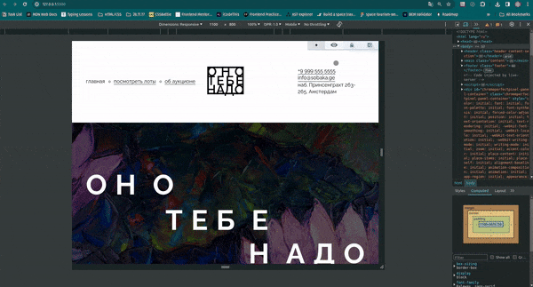
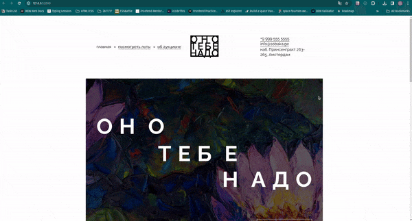

# [Ono tebe nado](https://ono-tebe-nadoo.netlify.app/)

A HTML, CSS project from Yandex.Practicum «Frontend Developer» course.

This project was created to focus using semantic HTML tags for better SEO and page navigation (accessibility). Flexbox and grid layout were used to create adaptive design

### Project Checklist

- adaptive page layout using **flexbox** and **grids**
- using **semantic** html tags (article, ul, li, address,...)
- element **positioning** (absolute, relative, z-index)
- applying web fonts using **@font-face** CSS at-rule
- 

    
<b>PixelPerfect</b> layout

    
  

### Figma Layout

Click [here](<https://www.figma.com/file/klGu9jTXgGd83ktFUWkAFq/%D0%9E%D0%BD%D0%BE-%D1%82%D0%B5%D0%B1%D0%B5-%D0%BD%D0%B0%D0%B4%D0%BE-(Copy)?type=design&node-id=0%3A1&mode=dev&t=HlKqPhO4aERs2xJ2-1>) to open Website Figma Layout

### Project Demo

Link to project website: https://ono-tebe-nadoo.netlify.app/

Website Preview:

